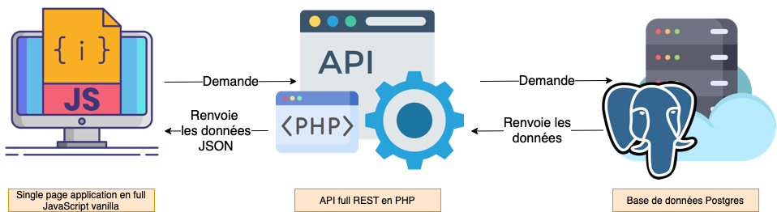

### Installation

> Cloner les deux github
> 

[API](https://github.com/Robinetyoann/api_tidal)

[APP](https://github.com/Robinetyoann/app_tidal)

> Back-end
> 

Placer le dossier dans WAMP (projet api_tidal)

⚠️ **Attention à votre user pass dans la base de données (root:root)**


> Front-end
> 

Depuis le dossier du projet lancer la commande :

```bash
python3 -m http.server
```


### Fonctionnement général



### Back-end

[API Repo](https://github.com/Robinetyoann/api_tidal)

> Général
> 

[API REST](https://www.notion.so/06d8a3ceff3748e2b6d4f9a92af4cf81)

ℹ️ **PHP full POO**

> Vidéos utiles pour le développement
> 

[Comment créer une architecture MVC sécurisée en PHP](https://www.youtube.com/watch?v=54Km7DQjXLk&list=PLnklsuFp-quSzFDZ0F_dAKGlqOQGOdD2a)

> Documentation
> 

[Manuell PHP](https://www.php.net/manual/fr/)

> Forum
> 

[Stack overflow](https://stackoverflow.com/questions/tagged/php)

> Utile
> 

**Fonctionnement optimisé pour changer l'existant et/ou ajouter de nouvelles fonctionnalitées (PHP POO)**

### Front-end

[APP Repo](https://github.com/Robinetyoann/app_tidal/tree/main)

> Général
> 

ℹ️ **SPA full Javscript vanilla**

> Lien utile pour le développement
> 

GitHub

> Documentation
> 

[MDN Javascript](https://developer.mozilla.org/fr/docs/Web/JavaScript)

> Forum
> 

[Stack overflow](https://stackoverflow.com/questions/tagged/javascript)

> Utile
> 

**Fonctionnement optimisé pour changer l'existant et/ou ajouter de nouvelle fonctionnalité (JS)**